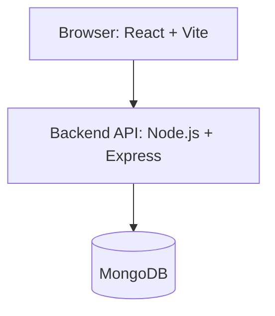

<div align="center">

# 🧠 INIQ

### Interview Intelligence Platform

*A full-stack platform to collect, structure, and explore real-world interview experiences with round-wise clarity.*

[](https://react.dev)
[](https://nodejs.org)
[](https://www.mongodb.com)
[](https://jwt.io)

[](./LICENSE)
[]()
[](http://makeapullrequest.com)

</div>

---

## 📖 Table of Contents

- [🌟 Overview](#-overview)
- [💡 Problem and Solution](#-problem-and-solution)
- [✨ Key Features](#-key-features)
- [🏗️ System Architecture](#️-system-architecture)
- [🛠️ Tech Stack](#️-tech-stack)
- [📂 Monorepo Structure](#-monorepo-structure)
- [🚀 Getting Started](#-getting-started)
- [⚙️ Environment Variables](#️-environment-variables)
- [📜 Available Scripts](#-available-scripts)
- [🔌 API Overview](#-api-overview)
- [🗄️ Data Model](#️-data-model)
- [🔒 Security](#-security)
- [👥 Roles and Ownership](#-roles-and-ownership)
- [🗺️ Roadmap](#️-roadmap)
- [📄 License](#-license)

---

## 🌟 Overview

Interview preparation content is often scattered across chats, forums, and random blog posts. **INIQ** turns that messy data into a **structured, searchable Interview Experience Portal**. [file:2]

> Think of it as: **“Structured Glassdoor for interview rounds”** – with clear topics, code, and verdicts.

Core ideas:

- **Crowdsourced experiences**: candidates submit their real interviews using a standard form. [file:2]  
- **Structured rounds**: each round is captured separately with questions, code, explanation, and optional video. [file:2]  
- **Moderated quality**: admins approve, edit, or delete entries before they appear publicly. [file:2]  

---

## 💡 Problem and Solution

### ❌ Problem

- Interview experiences are **unstructured** (no common format). [file:2]  
- Hard to know:
  - How many rounds to expect.
  - What kind of DSA / HLD / LLD topics appear frequently. [file:2]
  - What specific questions and code solutions appeared. [file:2]
- No central place where content is:
  - **Standardized, filterable, and moderated**.

### ✅ Solution

- A dedicated **Interview Experience Portal** with:
  - User Portal for submissions and learning. [file:2]
  - Admin Portal for review and curation. [file:2]
- Standardized submission format:
  - Company, role, experience years, overview. [file:2]
  - Structured topics (DSA/HLD/LLD). [file:2]
  - Round-wise details (title, questions, code, explanation, video). [file:2]
  - Final verdict and candidate advice. [file:2]
- Clean UI:
  - Collapsible round cards.
  - Code blocks with formatting.
  - Optional video embedding for explanations. [file:2]

---

## ✨ Key Features

### 👤 User Portal

- **JWT-based authentication**
  - Register and login as a normal user.

- **Structured interview submission**
  - Company (dropdown + option to add new). [file:2]
  - Role (SDE, SRE, MLOps, Frontend, Backend, etc.). [file:2]
  - Candidate experience (years). [file:2]
  - 3–4 line interview process overview. [file:2]
  - Topics grouped as:
    - DSA (Arrays, Dynamic Programming, Graphs). [file:2]
    - HLD (Caching, Scalability, System Design). [file:2]
    - LLD (SOLID Principles, Design Patterns). [file:2]
  - Dynamic rounds:
    - Round title, questions, code solution, explanation, optional video link. [file:2]
  - Final verdict (Selected / Rejected). [file:2]
  - Optional candidate advice. [file:2]

- **Learn from others**
  - Browse approved experiences.
  - Filter by company and role.
  - Open detail view with all rounds, topics, and code.

### 🛡️ Admin Portal

- **Moderation tools**
  - View all submissions (Pending / Approved / Rejected). [file:2]
  - Approve or reject experiences.
  - Edit content to fix issues.
  - Delete inappropriate entries. [file:2]

- **Master data management**
  - Manage company list (for dropdown). [file:2]
  - Manage role list (for dropdown). [file:2]

### 🧾 Experience Model Highlights

- Company, Role, Candidate Experience.
- Overview (3–4 lines).
- Topics: DSA, HLD, LLD.
- Rounds[]:
  - Title, Questions, Code, Explanation, Video link.
- Final Verdict: Selected / Rejected.
- Candidate Advice (Optional).
- Status: Pending / Approved / Rejected.

---

## 🏗️ System Architecture



Design principles:

- **Separation of concerns**
  - Frontend and backend split under `app/` as `web` and `api`.
- **Layered backend**
  - Routes → Controllers → Services → Models.
- **Role-based access**
  - User vs Admin permissions enforced via middleware.

---

## 🛠️ Tech Stack

| Layer       | Technology                |
| :--------- | :------------------------ |
| Frontend   | React + Vite (JavaScript) |
| Styling    | Tailwind CSS or Material UI |
| Backend    | Node.js + Express (Jpt) |
| Database   | MongoDB + Mongoose        |avaScri
| Auth       | JWT (JSON Web Tokens)     |
| Dev Tools  | ESLint, Prettier, Jest/RTL|
| Monorepo   | npm scripts (mono layout) |

---

## 📂 Monorepo Structure

```text
iniq-interview-intelligence-platform/
├── README.md
├── LICENSE
├── package.json                 # root scripts: dev, test, lint, install
├── .gitignore
├── .editorconfig
├── .env.example                 # shared env example
│
├── docs/
│   ├── requirements/
│   │   └── interview-experience-requirement.pdf
│   ├── architecture/
│   │   ├── system-overview.md
│   │   ├── api-design.md
│   │   └── db-design.md
│   └── ui-ux/
│       ├── wireframes-user-portal.md
│       └── wireframes-admin-portal.md
│
├── app/
│   ├── api/                     # Node.js + Express + MongoDB
│   │   ├── package.json
│   │   ├── .env.example
│   │   └── src/
│   │       ├── app.js
│   │       ├── server.js
│   │       ├── config/
│   │       ├── modules/
│   │       ├── middleware/
│   │       ├── routes/
│   │       ├── utils/
│   │       └── tests/
│   │
│   └── web/                     # React + Vite frontend
│       ├── package.json
│       ├── .env.example
│       └── src/
│           ├── main.jsx
│           ├── App.jsx
│           ├── routes/
│           ├── config/
│           ├── api/
│           ├── context/
│           ├── layout/
│           ├── components/
│           ├── pages/
│           ├── styles/
│           ├── types/           # optional JS typedefs / JSDoc helpers
│           └── tests/
│
└── scripts/
    ├── setup-win.bat            # Windows setup helper
    ├── setup-unix.sh            # Linux/macOS setup helper
    └── seeding.md               # DB seeding notes (admin user, sample data)
```

*(If you already created `.ts`/`.tsx` files, rename them to `.js`/`.jsx` to stay consistent with JavaScript.)*

---

## 🚀 Getting Started

### ✅ Prerequisites

- Node.js >= 18  
- npm >= 10  
- MongoDB (local or Atlas)  
- Git  

### 🧩 Initial Setup

```bash
git clone https://github.com/saikriz898/iniq-interview-intelligence-platform.git
cd iniq-interview-intelligence-platform
```

#### Option 1 – Using scripts (recommended)

**Windows**

```bat
scripts\setup-win.bat
```

**Linux / macOS**

```bash
./scripts/setup-unix.sh
```

#### Option 2 – Manual

```bash
npm install           # root dev deps (e.g., concurrently)

cd app/api
npm install

cd ../web
npm install
```

---

## ⚙️ Environment Variables

### app/api/.env

Copy `.env.example` → `.env` in `app/api` and set:

```env
PORT=5000
MONGODB_URI=mongodb://localhost:27017/iniq
JWT_SECRET=super-secret-key
NODE_ENV=development
```

### app/web/.env

Copy `.env.example` → `.env` in `app/web` and set:

```env
VITE_API_BASE_URL=http://localhost:5000/api
```

---

## 📜 Available Scripts

From the **monorepo root**:

| Script             | Description                               |
| :---------------- | :----------------------------------------- |
| `npm install`     | Install root and workspace dependencies    |
| `npm run dev`     | Run API and Web together (concurrently)    |
| `npm run dev:api` | Run only backend (app/api)                 |
| `npm run dev:web` | Run only frontend (app/web)                |
| `npm run test`    | Run backend and frontend tests             |
| `npm run test:api`| Run backend tests only                     |
| `npm run test:web`| Run frontend tests only                    |
| `npm run lint`    | Run linters across workspaces              |

From **app/api**:

- `npm run dev` – start Express API with nodemon.
- `npm test` – run backend tests.

From **app/web**:

- `npm run dev` – start Vite dev server.
- `npm test` – run frontend tests.

---

## 🔌 API Overview

Base prefix:

```text
/api
```

### Auth

- `POST /api/auth/register` – user registration.
- `POST /api/auth/login` – login, returns JWT.

### Companies

- `GET /api/companies` – list active companies.
- `POST /api/companies` – create company (ADMIN).
- `PUT /api/companies/:id` – update company (ADMIN).
- `DELETE /api/companies/:id` – delete/deactivate company (ADMIN).

### Roles

- `GET /api/roles` – list active roles.
- `POST /api/roles` – create role (ADMIN).
- `PUT /api/roles/:id` – update role (ADMIN).
- `DELETE /api/roles/:id` – delete/deactivate role (ADMIN).

### Interviews – User

- `POST /api/interviews` – create a new interview (USER).
- `GET /api/interviews` – list approved interviews (public).
- `GET /api/interviews/:id` – get one approved interview (public).
- `GET /api/my/interviews` – list own interviews (USER).
- `PUT /api/my/interviews/:id` – update own interview (USER).
- `DELETE /api/my/interviews/:id` – delete own interview (USER).

### Interviews – Admin

- `GET /api/admin/interviews` – list all (ADMIN).
- `GET /api/admin/interviews/:id` – detail (ADMIN).
- `PATCH /api/admin/interviews/:id/approve` – approve (ADMIN).
- `PATCH /api/admin/interviews/:id/reject` – reject (ADMIN).
- `PUT /api/admin/interviews/:id` – edit any interview (ADMIN).
- `DELETE /api/admin/interviews/:id` – delete any interview (ADMIN).

---

## 🗄️ Data Model

### users

- `name`
- `email`
- `passwordHash`
- `role` (`USER` / `ADMIN`)
- timestamps

### companies

- `name`
- `slug?`
- `description?`
- `website?`
- `isActive`
- timestamps

### roles

- `name`
- `description?`
- `isActive`
- timestamps

### interview_experiences

- `userId` (who submitted)
- `companyId`
- `roleId`
- `candidateExperienceYears`
- `overview` (3–4 line summary)
- `topics`:
  - `dsa: string[]`
  - `hld: string[]`
  - `lld: string[]`
- `rounds: Round[]`
  - `order`
  - `title`
  - `questions`
  - `codeSolution`
  - `explanation`
  - `videoUrl?`
- `finalVerdict` (`SELECTED` / `REJECTED`)
- `advice?` (candidate advice)
- `status` (`PENDING` / `APPROVED` / `REJECTED`)
- `approvedBy?`, `approvedAt?`
- timestamps

---

## 🔒 Security

- **JWT Authentication**
  - All protected APIs require a valid JWT from login.

- **Role-Based Authorization**
  - Admin routes (`/api/admin/*`, company/role mutations) require `role=ADMIN`. [file:2]

- **Backend security**
  - Helmet for security headers.
  - CORS configuration.
  - Basic rate limiting on API.

- **Validation**
  - Input validation for all create/update endpoints, enforcing the form requirements from the original requirement document. [file:2]

---

## 👥 Roles and Ownership

- **Sai Krishnan**
  - Project Owner.
  - Frontend & Integration Lead (React, routing, UI/UX).

- **Raghuram**
  - Backend & Database Lead (Express, MongoDB, APIs).

Both collaborate on:

- Testing.
- Documentation.
- Final deployment and demo preparation.

---

## 🗺️ Roadmap

All features are currently planned for implementation.

| Feature                                 | Status      |
| :-------------------------------------- | :---------- |
| Core auth (register/login)             | ⏳ Planned  |
| Interview submission + display         | ⏳ Planned  |
| Admin approval & edit flows            | ⏳ Planned  |
| Company/Role master management         | ⏳ Planned  |
| Advanced search & filters              | ⏳ Planned  |
| “My Interviews” user dashboard         | ⏳ Planned  |
| Bookmarks / favorites                  | ⏳ Planned  |
| Analytics dashboard for admins         | ⏳ Planned  |

---

## 📄 License

This project is licensed under the **MIT License** – see the [LICENSE](./LICENSE) file for details.

---

<div align="center">
Built with ❤️ by <b>Sai Krishnan</b> and <b>Raghuram</b><br/>
<i>Clean architecture • Structured interviews • Learning-focused</i>
</div>